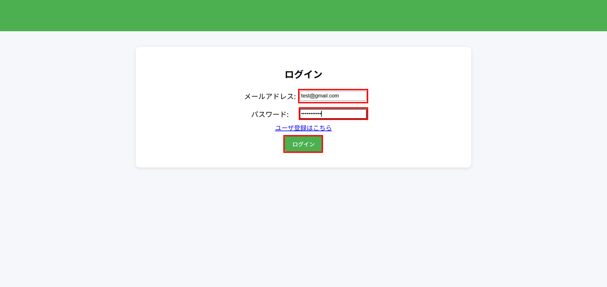
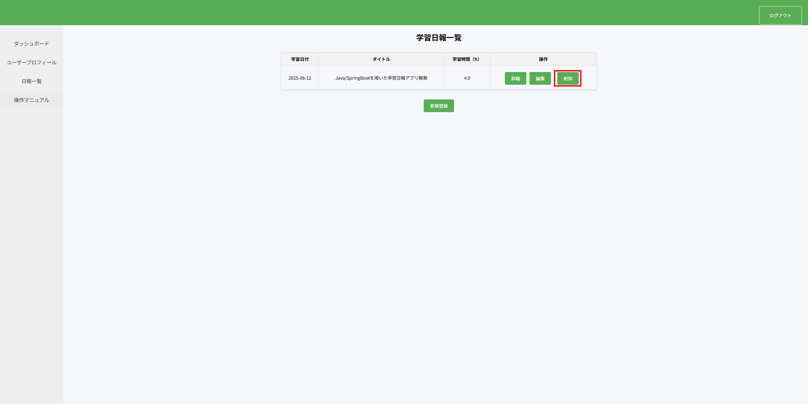
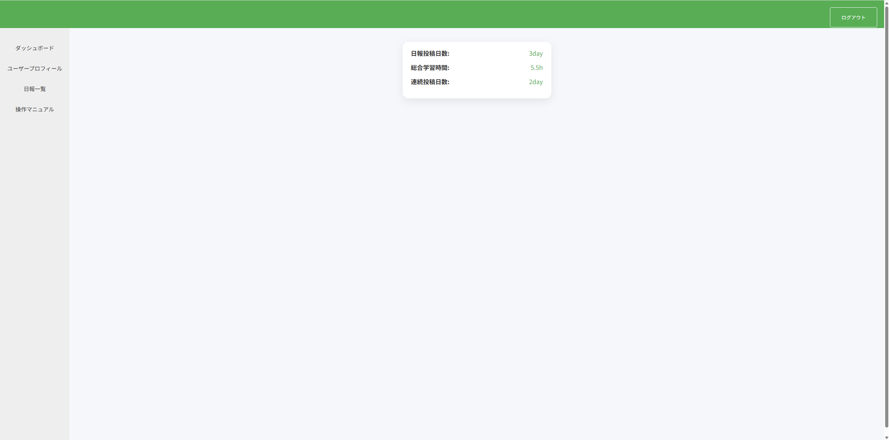

## 操作マニュアル
本マニュアルでは、学習日報アプリの基本機能に関する操作手順を記載しています。  
エラーメッセージの表示例や対応方法については、後日追記予定です。

### ユーザ登録
1. ログイン画面が表示されるので「ユーザ登録はこちら」をクリックします。

2. ユーザ登録画面で「メールアドレス」「パスワード」「パスワード確認」を入力し「登録」をクリックします。

3. ログイン画面に遷移し、「ユーザ登録が完了しました。」とメッセージが表示されると、ユーザ登録完了です。

### ログイン
1. 登録済みの「メールアドレス」「パスワード」を入力し、「ログイン」をクリックします。  
※未登録の場合は「ユーザ登録はこちらをクリック」をクリックして、ユーザ登録画面にてユーザ登録を行ってください。

2. ダッシュボード画面に遷移するとログイン成功です。

### 学習日報の登録
1. サイドバーの「日報一覧」をクリックすると、学習日報一覧画面に遷移します。

2. 「新規登録」をクリックすると日報登録画面に遷移します。

3. 登録内容を入力し、「登録する」をクリックします。

4. 学習日報一覧画面に遷移し、「日報の登録が完了しました。」と表示されると登録完了です。

### ※登録せずに一覧画面に戻る場合
5. 登録せずに戻る場合は「一覧に戻る」をクリックしてください。

6. 学習日報の一覧画面に遷移します。（入力内容は保存されません）

### 学習日報の詳細表示
1. 登録済みの日報の「操作」欄の「詳細」をクリックして、日報詳細画面に遷移します。

### 詳細画面での操作(編集、戻る、削除)
2. 日報詳細画面で「編集」をクリックすると日報編集画面に遷移します。

3. 日報詳細画面で「一覧に戻る」をクリックすると学習日報一覧画面に遷移します。

4. 日報詳細画面で「削除」をクリックします。

5. 確認ダイアログが表示されるので「OK」をクリックします。

6. 日報一覧画面に遷移し、「日報を削除しました。」とメッセージ表示され、詳細画面に表示していた日報が削除されます。 

### 学習日報の編集
1. 登録済みの日報の「操作」欄の「編集」をクリックして、日報編集画面に遷移します。

2. 編集内容を入力し、「編集する」をクリックします。

3. 学習日報一覧画面に遷移し、「日報の編集が完了しました。」と表示されると編集完了です。

### ※編集せずに一覧画面に戻る場合
4. 編集しないで戻る場合は「一覧に戻る」をクリックしてください。

5. 学習日報の一覧画面に遷移します。（入力内容は保存されません）

### 学習日報の削除
1. 登録済みの日報の「操作」欄の「削除」をクリックします。

2. 確認ダイアログが表示されるので「OK」をクリックします。

3. 日報一覧画面に遷移し、「日報を削除しました。」とメッセージ表示され、「削除」をクリックした日報が削除されます。

### ユーザープロフィール編集
1. サイドバーの「ユーザプロフィール」をクリックすると、ユーザプロフィール画面に遷移します。  
※ユーザ登録直後は下記が設定されています。  
アイコン画像：デフォルトアイコン  
ユーザ名：未設定ユーザー  

2. 「プロフィール編集」をクリックします。

3. 編集内容を入力し「編集する」をクリックします。

4. ユーザプロフィール画面に遷移し、「プロフィールの編集が完了しました。」と表示されると、編集完了です。

### ダッシュボードについて
- 日報投稿日数：学習日報を登録した累計日数
- 総合学習時間：登録済みの日報の合計学習時間
- 連続投稿日数：直近に登録された日報から何日間連続で投稿できているかを計測した日数

