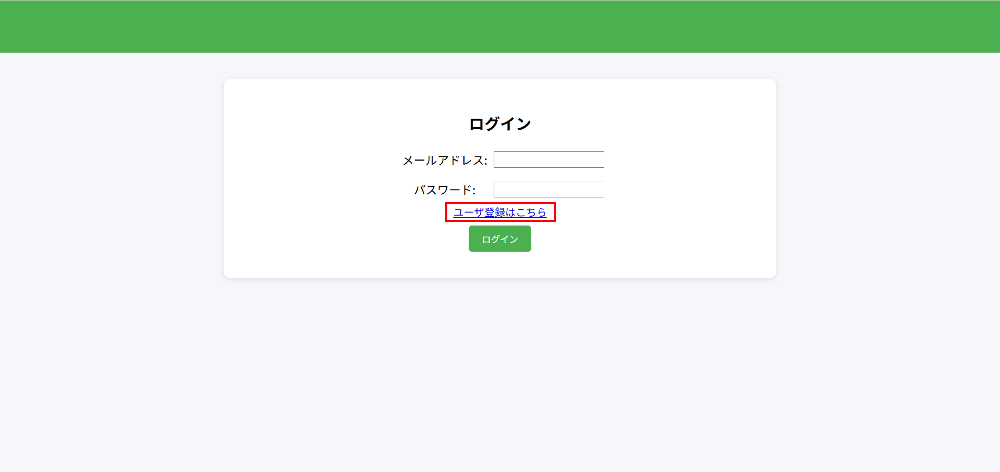

## 操作マニュアル

### ユーザ登録
1. ログイン画面が表示されるので「ユーザ登録はこちらをクリック」を押下。

2. ユーザ登録画面で「メールアドレス」「パスワード」「パスワード確認」を入力し「登録」を押下。
3. ログイン画面に遷移し、「ユーザ登録が完了しました。」とメッセージが表示されたら、ユーザ登録完了。
- 説明とスクリーンショット

### ユーザープロフィール編集
- アイコン画像の変更方法など

### 学習日報の登録
- タグ入力やチャレンジ枠の追加方法

### ダッシュボードの見方
- 連続日数、累積学習時間の解説

### 注意事項
- 対応画像形式、ファイルサイズ制限 など
